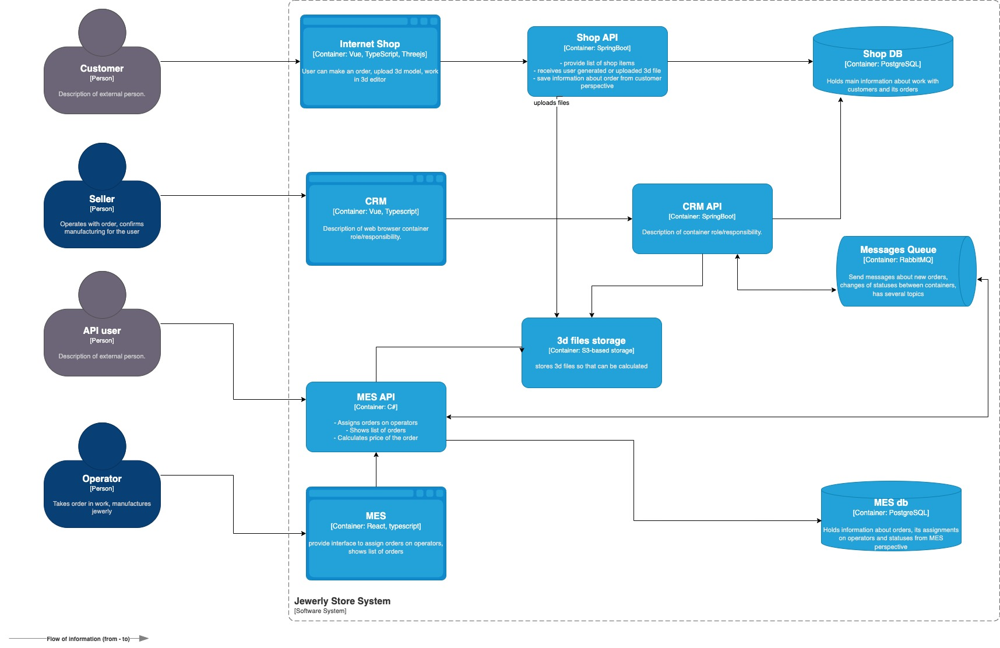

# Задание 1. Анализ, идентификация проблем и решений, планирование

## 1.  Описание того, что есть

В настоящее время система выглядит следующим образом:

Имеется 3 монолита, общающиеся между собой по рэббиту, 3 веб-интерфейса к ним, 2 БД и S3 бакет для файлов. 
Апишки крутятся в AWS на EC2 инстансах, базы данных - единичные управляемые сервисы в Yandex Cloud.

Каждая апишка содержит собственные механизмы авторизации и аутентификации и, стало быть, базу пользователей,
и проблем с этим делом не наблюдается.

>⚠️ На C4-диаграмме отсутствует какой-либо платёжный шлюз. В дальнейшем примем за данность, что оплата производится
> клиентом по банковским реквизитам, после чего подтверждается менеджером вручную. То же самое с отслеживанием статуса 
> доставки заказа - этот момент упомянут, но на схеме не отображен, значит менеджер все это делает вручную.

Есть 3 окружения: `dev`, `release` и `prod`; в первую развертывание автоматическое после ручной прогонки тестов,
в остальные - ручками.

Следующие спецы доступны 'из-коробки':
- Фронтенд — два инженера Vue, один частично знает React.
- Бэкенд — два инженера Java, один разработчик на C#.
- QA — один инженер по ручному тестированию, хочет заняться автоматизацией и уже делал несколько прототипов.
- Тимлид — бывший разработчик на C#.
- Продакт-менеджер — общается с бизнесом, отвечает за поддержку приложения.
- Один DevOps-инженер.

Помимо них в процессе участвуют:
- Продавцы — это пользователи CRM.
- Операторы — пользователи MES.
- Администраторы — к ним относятся продакт-менеджер, тимлид и менеджеры по продажам.

Прямо сейчас жалуются на:
- Срыв сроков изготовления и доставки заказа для всех категорий клиентов;
- Непомерно долгую загрузку списка заказов из MES;
- Высокий TTM для новых функций и багфиксов.

## 2. Идентификация проблемных зон

Исходя из вышеописанного, можно выявить следующие болячки:

- ~~Отсутствие репликации БД, приводящее к медленному чтению в MES (ибо лагает даже с пагинацией);~~
- Отсутствие автотестов, из-за чего вся система похожа на велосипед без седла;
- Отсутствие кэширования, что приводит к медленному чтению;
- Отсутствие средств наблюдаемости, из-за чего проблематично выявить места отвала запросов;
- Географическое удаление приложения от БД (при условии, что EC2 это вот прям конкретно AWS);
- Использование одной базы разными сервисами (если схема не врёт, `Shop API` и `CRM API` ходят в один постгрес);
- Отсутствие нормального CI/CD;
- Отсутствие связи `Shop API --> RabbitMQ` - магазин не уведомляет CRM о новом заказе,
менеджер вынужден вручную мониторить списки;
- Ручная валидация статуса оплаты/доставки заказа;
- Самостоятельное назначение операторов на поступившие заказы;

**Последние 2 пункта представляют собой недостатки бизнес-процесса, а не его автоматизации. 
В контексте задачи они могут быть проигнорированы, но донести их до стэйкхолдеров лишним не будет.**

## 3. Инициативы по устранению нежелательных ситуаций

Что должно быть сделано, чтобы всё перестало быть столь печальным:

1. Реализовать наблюдаемость системы;
2. Внедрить кэширование;
3. Нанять пару тестировщиков и фронтэндера по реакту (или дообучить имеющихся спецов);
4. Покрыть бэкэнды юнит и интеграционными тестами;
5. Внедрить CI/CD для продакшн бранча;
6. Разобраться с одной базой на магазин и CRM - либо разделить их, либо слить 2 сервиса в один условный маркетплэйс;
7. Перетащить инстансы API в Yandex Cloud поближе к базам (ну или базы закатать в AWS);
8. Оптимизировать исходный бизнес-процесс (автоматическое назначение заказов операторам, онлайн-оплата,
автоматическое отслеживание доставки, разделение операторов на изготовителей/доставщиков,
внедрение сервиса уведомлений etc etc etc); 
9. Порезать все это дело на сервисы поменьше (унифицировать базу пользователей, обернуть все в гейт для единой точки входа).

## 4. Приоритизация инициатив

По моему видению через полгода идеальная сферическая система по производству ювелирки на заказ 
должна выглядеть следующим образом:

[C4 to-be.puml](./to-be.puml)

Приводим систему к микросервисному лэндскейпу. 
Возможно, это будут даже просто модульные монолиты, которые будут утилизировать общий функционал аутентификации
и рассылки уведомлений.

Заказы и каталог товаров уже конкретно разделены по разным БД, чтобы 2 апишки не пользовались одной. 
Репликация/шардирование на данном этапе не предусмотрены из-за небольшого потока данных 
(ювелирные изделия - не ходовой товар; тормоза базы связаны с кривой логикой/ддосом), но предполагаются в
дальнейшем.

За ширмой идёт настройка CI/CD в Jenkins так, чтобы при пуше в `master` автоматически выполнялись все категории
тестов и происходило автоматическое развёртывание при их успешном прохождении.

MES API использует паттерн Backpressure, чтобы не допустить отвала подготовки заказа из-за перегрузки системы
дорогими расчётами.

Все компоненты пишут логи/метрики/трэйсы через `OpenTelemetry` и складывают их в [OpenObserve](https://github.com/openobserve/openobserve).
Эта штука выбрана в качестве замены стандартного ELK-стэка, т.к. в разы проще настраивается (а значит единственный
девопс на проекте не поседеет) и обходится в разы дешевле. Если сильно прижмет, можно будет заменить - otel же.

### **Ключевые 3 пункта**

В [п.3](#3-инициативы-по-устранению-нежелательных-ситуаций) инициативы расставлены в порядке их критичности,
соответственно, в первую очередь следует выполнить первые 3:

**Реализовать наблюдаемость системы**

Бизнес уже сейчас теряет деньги и репутацию, значит нашей первостепенной задачей становится поиск мест,
из-за которых это происходит. Чтобы их найти и нужна наблюдаемость системы. 

**Внедрение кэширования**

Прямо сейчас КПД операторов снижен из-за того, что они не могут оперативно смотреть список заказов.
Вполне вероятно, что сроки изготовления срываются из-за этого. Фиксим во вторую очередь.

**Нанять тестировщиков и фронтэндера**

Этот пункт, опять же, скорее организационный, нежели архитектурный, но всё же.

Нам кровь из носу нужно покрыть систему юнит и интеграционными тестами. В идеале это должна быть отдельная
команда только под тесты. Данный шаг стоит выше написания самих тестов, потому что процесс найма займёт неизвестное 
количество времени - чем раньше начнем, тем раньше покроем. Первый пункт позволит обнаружить точки отвала запросов,
разобрать их получится поначалу и без тестов - на худой конец сами джависты/шарписты смогут покрыть
самые критичные участки кода.

Фронтэндер по реакту (или дообучение на него) включены из-за того, что у нас есть вебморда для MES, которая
написана на реакте. Если единственный знающий его спец уволится, умрёт или еще как-нибудь выйдет из строя,
багфикс и доработка этого компонента системы встанут полностью, чего хотелось бы избежать.

